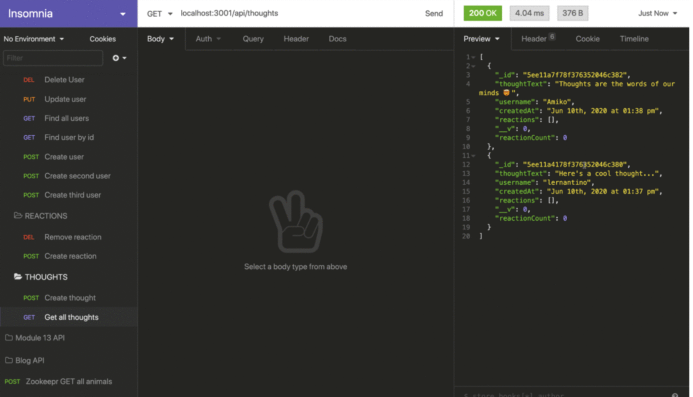
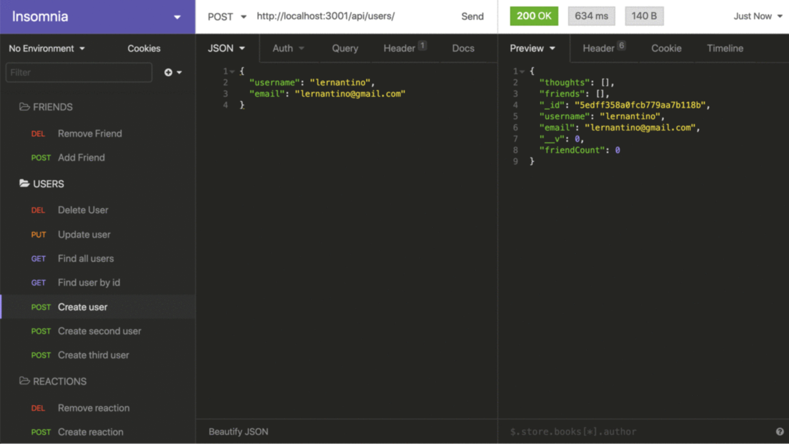

# NoSQL Social Networking API

## About The Project
This project is a NoSQL-based social networking API that allows users to connect with each other, share their thoughts, and react to thoughts. It is built using Express.js, Node.js, and MongoDB, following the MVC architecture pattern.

The API provides various endpoints for creating users, adding thoughts, adding reactions to thoughts, managing friend connections, and retrieving user and thought data. Users can create an account, post their thoughts, add reactions to thoughts, and establish friend connections with other users.

The backend server defines API routes for handling the various requests made by the client. It utilizes controllers to handle the logic for user and thought operations and interacts with the MongoDB database using Mongoose.

## Built With
Express.js
Node.js
MongoDB
Mongoose

## Getting Started
To access this project, visit the repository link: https://github.com/andrewbreytenbach/nosql-social-netowrk-api

To get a local copy up and running, clone this repository to your local machine and run npm install to install the necessary dependencies. Make sure you have MongoDB installed and running on your machine. Update the MongoDB connection details in the .env file. Then run npm start to start the server and access the API endpoints.

## Usage
The API provides the following endpoints:

/api/users: CRUD operations for users.

Login Page Screenshot: 

/api/thoughts: CRUD operations for thoughts.

/api/users/:userId/friends/:friendId: Add and remove friends for a user.

Homepage Screenshot: 

/api/thoughts/:thoughtId/reactions: Add and remove reactions to a thought.

To test the API, you can use tools like Postman or Insomnia to send HTTP requests to the appropriate endpoints.

Check out this link for a full video walkthrough:
[https://drive.google.com/file/d/1qRL5slVJ4kH8RxzdxBVNAEvDUZvNwTpV/view] 

## API Documentation
For detailed information about the API endpoints and request/response formats, please refer to the API documentation available in the API Documentation file.

## Contact
* [https://expressjs.com/] (Andrew Breytenbach)

## Acknowledgments
* [https://expressjs.com/] (Express Documentation)
* [https://nodejs.org/en/docs] (Node.js Documentation)
* [https://www.mongodb.com/docs/] (MongoDB Documentation)
* [https://mongoosejs.com/docs/] (Mongoose Documentation)
